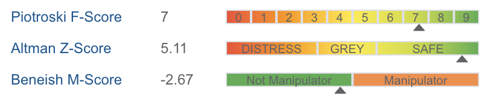
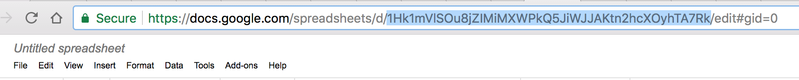

# Finviz-Scraper
Simple Scraper for [Finviz](https://finviz.com/) stock data.

The function `scrape_finviz` accepts a `list` of tickers and returns a pandas `dataframe`. All data from the financial highlights table (72 variables) as well as the sector, sub-sector and country are returned. A progress bar is displayed for tracking (requires the `progressbar` library)


Extended version fetches Gurufocus' Piotroski F-Score, Altman Z-Score and Beneish M-Score along with two values of ROIC and WACC, appending them as last 5 columns in the resulting dataset.



## Usage
The list of tickers may be in `uppercase` or `lower case`
```python
# data is a pandas DataFrame
data=scrape_finviz(['FB','INGN'])
```

the file user-specific-variables has following data:
```python
json_file = '/Users/username/your_json_file'
sheet_key = 'your_sheet_key_taken_from_address_bar'
worksheet_title = 'your_worksheet_title'
```

## Google Sheets integration
This code uses pygsheets library to access google sheets.
Enable API and create a Service Account at https://console.developers.google.com/apis

Then, allow freshly created account to edit your sheet and download service key as JSON file.

To locate sheet's key, use long string from the address bar:



## Multiprocessing

Multiprocessing is also implemented in `multiprocessing_finviz.py`. In this example tickers from the S&P500 are scraped, based on data from [https://datahub.io/](https://datahub.io/). To run open command prompt and enter:

```python
python multiprocessing_finviz.py <<save_path>>  
```
where <<save_path>> is the location to save the results (default is `C:/SnP500.csv`).

Scraped results are available in the [resource folder](https://github.com/xang1234/Finviz-Scraper/tree/master/resource)

## Data accuracy
The price data has a lag of 15-20 minutes. Certain financial ratios might be affected by the price. It is recommended to scrape after market close or before market open. Further cleaning of the scraped data might be required (e.g. Market Cap, Income and Sales are returned with B or M for Billion or Million respectively).
